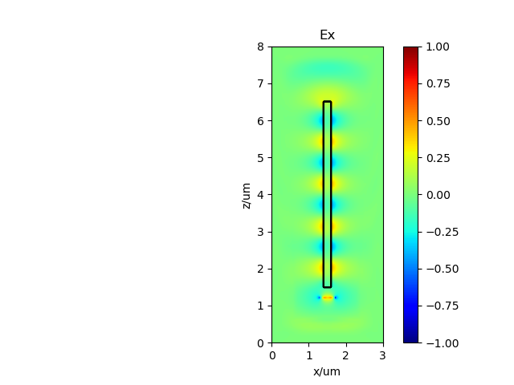
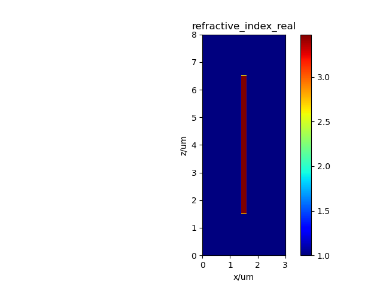
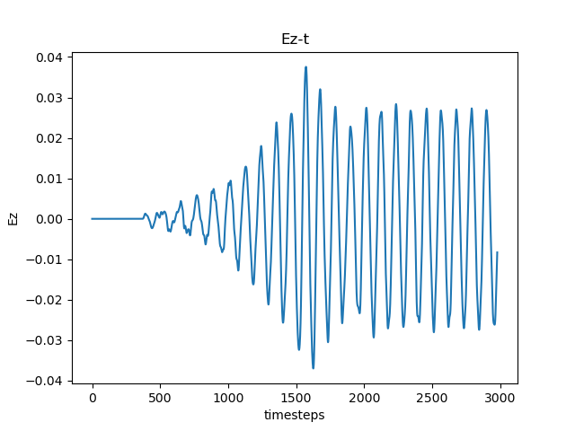
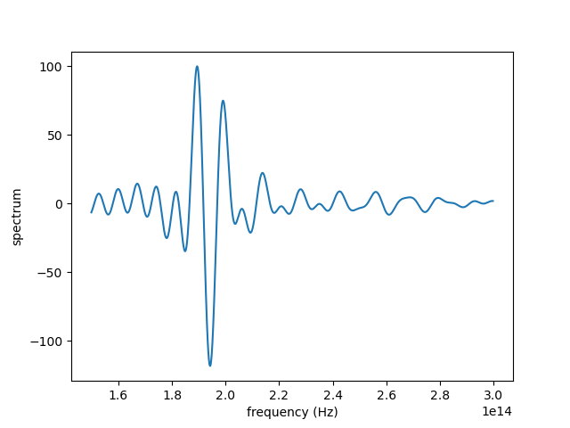

# PhotPassive Documentation

[TOC]

## 1 Module Overview

This software is a powerful and flexible simulation tool for optical devices, capable of supporting simulations of various passive optical components, including optical waveguides. Its modular design allows users to flexibly combine and configure simulation tasks using the various classes and methods in the PhotPassive module. Users can set the refractive index of the background medium, create high-resolution simulation grids, define the geometry and optical properties of optical devices in detail, configure light source parameters flexibly, and add monitors to detect changes in the electromagnetic field. Additionally, the software provides powerful results processing and visualization capabilities, enabling users to conveniently save, read, and plot simulation results.

## 2 Features

PhotPassive, based on [fdtd](https://github.com/flaport/fdtd) and [phisol](https://github.com/philmain28/philsol), implements three-dimensional time-domain simulation and two-dimensional mode calculation of optical transmission, and also provides pre-packaged waveguides and dozens of user-friendly examples.

* Waveguide - Straight waveguide
* Arc - Arc
* Sbend - S-shaped waveguide
* Ysplitter - Y-branch waveguide
* Cone (fiber) - Conical fiber
* Ellipsoid fiber - Elliptical fiber
* (Single mode) fiber - Single-mode fiber
* Fan-shaped waveguide grating (fwg) - Fan-shaped waveguide grating
* Directional coupler - Directional coupler
* Mmi (Multimode-interferometer) - Multimode interference coupler
* Ring (resonator) - Ring resonator
* Photonic Crystal (PC) - Photonic crystal
* Thin film filter (TFF) - Thin film filter
* Mach–Zehnder interferometer (MZI) (in progress) - Mach-Zehnder interferometer (unfinished)

## 3 Environment Dependencies

The development version can be installed by cloning the code repository:

```bash
git clone http://github.com/flaport/fdtd
```

Install the dependencies:

```bash
pip install -r requirements.txt
```

You can also install it by directly downloading and unzipping the .zip file.

## 4 Development Guide

Below is the workflow and usage example for a basic 2D simulation of a straight waveguide using photfdtd.

This example demonstrates a two-dimensional simulation of a basic rectangular waveguide.

### 4.1 Simulation Setup

Import the required classes:

```python
from photfdtd import Waveguide, Grid, Index
```

Set the material and background refractive index:

```python
background_index = 1.0
```

Select silicon (Si) as the waveguide material. `index_Re_Si` and `index_Im_Si` are the real and imaginary parts of the refractive index of silicon at a wavelength of 1550nm, respectively:

```python
index_Si = Index(material="Si")
index_Re_Si, index_Im_Si = index_Si.get_refractive_index(wavelength=1.55e-6)
```

Create a 3μm x 8μm two-dimensional (y-z) simulation region with a grid spacing of 20nm:

```python
grid = Grid(grid_xlength=3e-6, grid_ylength=1, grid_zlength=8e-6,
            grid_spacing=20e-9,
            permittivity=background_index ** 2,
            foldername="basic_ex")
```

Set a 200nm x 5μm waveguide and add it to the simulation region (grid):

```python
waveguide = Waveguide(
        xlength=200e-9, ylength=1, zlength=5e-6, refractive_index=index_Re_Si, name="waveguide", grid=grid)
```

Add the waveguide to the grid. The waveguide will automatically be placed in the center of the grid. If the waveguide exceeds the grid area, an error message will be displayed:

```python
grid.add_object(waveguide)
```

Set a line source with a center wavelength of 1550nm. The default mode of the source is continuous wave (CW):

```python
grid.set_source(source_type="linesource", wavelength=1550e-9, name="source", x=75, y=0, z=60,
                xlength=400e-9, ylength=0, zlength=0, polarization="x")
```

Set a line detector (monitor):

```python
grid.set_detector(detector_type="linedetector",
                  name="detector",
                  x=75,
                  y=0,
                  z=300,
                  xlength=400e-9,
                  ylength=0,
                  zlength=0
                  )
```

Now you can plot the geometry and refractive index distribution:

```python
grid.save_fig()
```

Plot the refractive index distribution at z=0:

```python
grid.plot_n()
```

### 4.2 Running and Results

Run the FDTD simulation:

```python
grid.run()
```

Save the simulation results. The results will be saved as a .npz file, which can be read using the `grid.read_simulation` method. For detailed information, refer to [read_FDTD_simulation.py](examples/read_FDTD_simulation.py):

```python
grid.save_simulation()
# grid = grid.read_simulation(folder=grid.folder)
```

Plot the field distribution at the end of the simulation:

```python
Grid.plot_field(grid=grid, field="E", field_axis="x", axis="y", axis_index=0, vmin=-1, vmax=1)
```

If a monitor was added, you can also plot the time-domain field variation curve at a certain point. Here, index=10 is chosen, which is the center of the monitor:

```python
Grid.plot_fieldtime(folder=grid.folder, grid=grid, field_axis="z", index=10, name_det="detector")
```

Using the monitor, you can also plot the spectrum:

```python
Grid.compute_frequency_domain(grid=grid, wl_start=1000e-9, wl_end=2000e-9, name_det="detector",
                              index=10, field_axis="x", field="E", folder=None)
```

### 4.3 Simulation Results






### 4.4 Other Examples

In the [examples](examples) directory, you can find examples of various optical devices, such as [waveguide_ex.py](examples/waveguide_ex.py), which represents an example of a straight waveguide.

#### Mode Solver Example

Below is an example "[fiber_ex.py](examples/mode_solver/fiber_ex.py)" for solving single-mode fiber modes using photfdtd. This example demonstrates the setup and use of the photfdtd mode solver.

Parameters for the single-mode fiber are as follows:

```
# Single-mode fiber mode analysis
# Cladding refractive index: 1.4437
# Core refractive index: 1.4504
# Core radius: 4um
# PML thickness: 3um
# Wavelength: 1.55um 
```

Import the required classes:

```python
from photfdtd import Fiber, Grid, Solve
```

Set the background refractive index:

```python
background_index = 1.4437
```

Create a simulation region (grid):

```python
grid = Grid(grid_xlength=200 * 200e-9, grid_ylength=200 * 200e-9, grid_zlength=1, grid_spacing=200e-9,
            foldername="test_fiber", permittivity=background_index ** 2)
```

Set the fiber parameters and add it to the grid:

```python
fiber = Fiber(length=1 * 200e-9, radius=[20 * 200e-9, 40 * 200e-9], refractive_index=[1.4504, 1.4555], name='fiber', axis='z', grid=grid)
grid.add_object(fiber)
```

Create a Solve variable, which is necessary for solving the mode:

```python
solve = Solve(grid=grid,
              axis="z",
              filepath=grid.folder,
              index=0
              )
```

Plot the refractive index distribution and geometry:

```python
solve.plot()
# Plot the x=0 cross-section structure
grid.save_fig(axis="z", axis_number=0)
```

Calculate 2 modes near the refractive index of 1.4504 at a wavelength of 1.55um, using PML boundaries:

```python
data = solve.calculate_mode(lam=1550e-9, neff=1.4504, neigs=20,
                            x_boundary_low="pml", y_boundary_low="pml",
                            x_boundary_high="pml",
                            y_boundary_high="pml",
                            background_index=background_index)
```

Save the results:

```python
Solve.save_mode(solve.filepath, data)
```

Plot the results:

```python
Solve.draw_mode(filepath=solve.filepath, data=data, content="amplitude")
```

## 5 Debugging Methods

1. Use print statements:
   - Insert `print()` statements in your code to output the values of variables or the execution state of the program. This is the simplest method and is suitable for quickly understanding the program's operation.
2. Use breakpoints and a debugger:
   - Most IDEs (such as PyCharm, VSCode) have built-in debuggers. You can set breakpoints in your code and then step through the code, checking the state at each step.
   - For example, in VSCode, you can set a breakpoint and then press F5 to start debugging mode.
3. Use the pdb module:
   - Python comes with a built-in debugging module `pdb`. You can insert `import pdb; pdb.set_trace()` in your code to start an interactive debugging session.
   - In this session, you can execute commands like `n` (next step), `c` (continue running), `q` (quit), etc.

## 6 Packaging Method

You can use `setuptools` or `wheel` to package the project. First, make sure you have these tools installed:

```bash
pip install setuptools wheel
```

Then, run the following command in the project's root directory:

```bash
python setup.py sdist bdist_wheel
```

This will create `.tar.gz` and `.whl` files in the `dist/` directory.

## 7 Deployment Steps

This software does not require deployment.

## 8 Copyright Statement