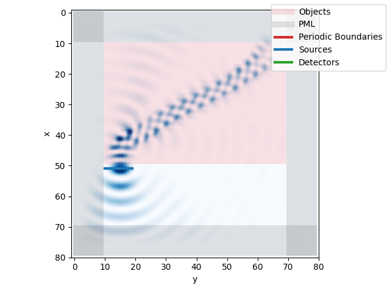

# PhotFDTD

Phot FDTD 目前包含了基础器件和光器件的实现和测试用例，使用了fdtd库已经实现了的 Finite-difference time-domain method （时域有限差分）算法。

## 基础器件

1. waveguide - 直波导
2. arc - 圆弧
3. sbend - s波导
4. ysplitter - y分支

## 光器件

光器件由基础器件组成，光器件与光器件之间也可以连接。

1. directional coupler - 方向耦合器
2. mmi - 多模耦合干涉仪
3. ring - 微环

## 安装

在命令行界面输入以下命令即可

```shell
pip install photfdtd
```

## Demo

```python
from photfdtd import Sbend


if __name__ == "__main__":

    # 设置器件参数
    sbend = Sbend(
        xlength=40, ylength=60, zlength=1, x=10, y=10, z=1, direction=-1, width=10, refractive_index=1.7, name="sbend"
    )

    # 设置 grid 参数
    sbend.set_grid(grid_xlength=80, grid_ylength=80, grid_zlength=1, grid_spacing=155e-9, total_time=200, pml_width=10)

    # 设置光源
    sbend.set_source()

    # 保存画好的图，设置保存位置，以及从哪一个轴俯视画图
    sbend.savefig(filepath="SbendZ.png", axis="z")
```

### 运行结果



## 各种光器件使用示例

在 `tests` 目录下，可以看到各种光器件的使用示例，例如 `waveguide_test.py` 代表着波导的使用示例。

## 开发者文档

[开发者文档](docs/developer-guide.md) 提供了对于开发者的指导。