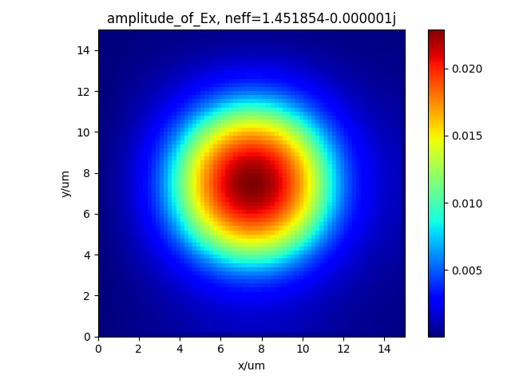

# PhotFDTD / PyPhotPassive

A 3D electromagnetic FDTD simulator written in Python. Packaged a wide range of user-friendly passive optical devices, with GPU accelerated calculation.

3D电磁FDTD仿真库，使用Python编写。封装了多种用户友好的无源光学器件，并支持GPU加速计算。

Based on [fdtd](https://github.com/flaport/fdtd) and [philsol](https://github.com/philmain28/philsol).

## Installation 安装
**推荐** 直接使用git获取整个库或下载压缩包。  

**Recommended** Directly cloning the repository or downloading the .zip file.:

```
git clone https://github.com/phot-lab/photfdtd.git
```

Download the .zip file of this repository:  
下载.zip压缩包：

```
https://github.com/phot-lab/photfdtd/archive/refs/heads/main.zip
```

Install requirements：  
安装需求：
```
pip install -r requirements.txt
```

## Dependencies 依赖项
matplotlib  
numpy  
scipy  
tqdm  
pathlib  
tabulate  
pandas  
pytorch  
h5py  
ffmpeg (optional, for video generation；可选，视频生成)  
cuda (optional, for GPU acceleration；可选，GPU加速)  


To install torch with CUDA support, please refer to [PyTorch official website](https://pytorch.org/get-started/locally/).  
要安装支持CUDA的torch，请参考[PyTorch官网](https://pytorch.org/get-started/locally/)。

## Contributing
All improvements or additions are welcome. Please make a pull-request 😊.   
所有的改进或添加都欢迎。请提交pull-request 😊。

## Components/Examples 结构/示例 

1. Waveguide - 直波导
2. Arc - 圆弧
3. Sbend - S型波导
4. Ysplitter - Y分支波导
5. Cone (fiber) - 圆锥光纤
6. Ellipsoid fiber - 椭圆形光纤
7. (Single mode) fiber - 单模光纤
8. Fan-shaped waveguide grating (fwg) - 扇形波导光栅
9. Directional coupler - 方向耦合器
10. MMI (Multimode-interferometer) - 多模耦合干涉器
11. Ring (resonator) - 环形谐振腔
12. Photonic Crystal (PC) - 光子晶体
13. Thin film filter (TFF) - 薄膜滤波器
14. Mach–Zehnder interferometer (MZI) - 马赫曾德干涉仪
15. Photonic Lanterns - 光子晶体
16. Arrayed waveguide grating (AWG) - 阵列波导光栅
17. Lantern - 光子灯笼

## FDTD example 1: a microring resonator 微环谐振腔
Here is an example of ring_ex.py in folder "./examples".
This example shows a 3D simulation of a microring resonator.  
这是一个在文件夹"./examples"中的[ring_ex.py](examples/ring_ex.py)示例。
### Set backend
Import required classes
```
from photfdtd import Grid, Index, Ring, Waveguide, fdtd
```
Photfdtd has 3 backends: numpy, torch and torch.cuda. The last one requires a GPU with CUDA support that can greatly accelerate the simulation.
It is always recommended to use the torch.cuda backend to simulate a ring resonator.  
Photfdtd有3个后端：numpy、torch和torch.cuda。其中torch.cuda需要支持CUDA的GPU，可以大大加速仿真。
```
fdtd.set_backend("torch.cuda")
```

### Comparation between different backeends
Comparation between different backeends for a grid with a scale of [200, 200, 200]. Tested on a NVIDIA RTX 4060 GPU.

|         | numpy | torch | torch.cuda |
|-----------------|-------|-------|------------|
| Simulation time | 2h10m | 1h27m | __5m24s__  |


### Simulation set up  

Set material and background index. We set the material of the ring to be silicon, the substrate to be SiO2, and the background index to be air.  
设置材料与背景折射率，设置环形谐振腔的材料为硅，基底为二氧化硅，背景折射率为空气。
```
index_Si = Index(material="Si")
index_Re_Si, index_Im_Si = index_Si.get_refractive_index(wavelength=1.55e-6)
index_SiO2 = Index(material="SiO2")
index_Re_SiO2, index_Im_SiO2 = index_SiO2.get_refractive_index(wavelength=1.55e-6)
```
Create a 3D simulation region of 15um x 2.5um x 20um, with a grid spacing of 40nm, a background index of 1. 
Basically, grid is the most important class in photfdtd, it is used to define the simulation region, 
add objects (including waveguides, sources and detectors) and visualize results.  
By setting the `foldername` parameter, the simulation results will be saved in a folder with the same name in the path.  
创建 11um x 2.5um x 10um 的三维模拟区域，网格间距为 40nm，背景折射率为 1。
grid是 photfdtd 中最重要的类，它用于定义模拟区域、
添加对象（包括波导、光源和探测器）以及可视化结果。 
通过设置`foldername`参数，仿真结果将保存在路径中同名的文件夹中。
```
grid = Grid(grid_xlength=11e-6, grid_ylength=2.5e-6, grid_zlength=10e-6, grid_spacing=40e-9, permittivity=1 ** 2,
                foldername="test_ring")
```
Pml will be automatically set to wavelength/2 in all directions when set source. One can also set PML manually:  
当设置光源时，PML会自动设置为所有方向上的波长的一半。也可以手动设置PML:
```
# PML will be automatically set to wavelength/2 in all directions when set source.
# It can also be set manually:
# grid.set_PML(pml_width_y=0.6e-6, pml_width_x=0.8e-6, pml_width_z=0.8e-6)
```
Set a ring and a substrate. This is an all-pass ring with an outer radius of 3.3µm, a thickness of 0.2µm, 
a straight waveguide width of 400nm, a ring width of 400nm, and a gap of 100nm. The refractive index is set to the real part of Si at 1550nm.   
Parameters x, y, z are default to simply put the ring in the center of the grid.  
Plz refer to [Ring](photfdtd/ring.py) for more details about the Ring class.  
设置一个环形谐振腔和基底并添加到grid中。
这是一个全通环，外半径为3.3µm，厚度为0.2µm，直波导宽度为400nm，环宽为400nm，间隙为100nm。折射率设置为1550nm时Si的实部。
参数x、y、z默认为将环形谐振腔放置在网格中心。
查看[Ring](photfdtd/ring.py)了解更多关于Ring类的细节。
```
ring = Ring(outer_radius=3.3e-6, ylength=0.20e-6, width_s=400e-9, width_r=400e-9, length=0e-6, length_s=10e-6,
                gap=100e-9, name="ring", refractive_index=index_Re_Si, grid=grid)
substrate = Waveguide(xlength=11e-6, ylength=1.15e-6, zlength=10e-6, y=1.15e-6 / 2, refractive_index=index_Re_SiO2,
                      grid=grid)
grid.add_object(ring)
grid.add_object(substrate)
```
Set a line source with center wavelength at 1550nm, the profile and pulse type of it are both gaussian.
Refer to [grid.set_source()](photfdtd/grid.py) for more details about the source class.
设置一个中心波长为1550nm的高斯脉冲光源。查看[grid.set_source()](photfdtd/grid.py)了解更多关于光源类的细节。

```
grid.set_source(source_type="linesource", wavelength=1550e-9, pulse_type="gaussian",waveform="gaussian",
                    x_start=1.7e-6,x_end=2.1e-6, z=1.0e-6,
                    xlength=0.4e-6,ylength=0, zlength=0, polarization="x")
```
Set a line detector at each of the four ports. Refer to [grid.set_detector()](photfdtd/grid.py) for more details about the detector class.  
在每一个端口上设置一个线监视器。查看[grid.set_detector()](photfdtd/grid.py)了解更多关于监视器类的细节。
```
    grid.set_detector(detector_type='linedetector',
                      x_start=1.7e-6, x_end=2.1e-6, z=1.0e-6,
                      ylength=1, zlength=1,
                      name='detector1')
    grid.set_detector(detector_type='linedetector',
                      x_start=1.7e-6, x_end=2.1e-6, z=9e-6,
                      ylength=1, zlength=1,
                      name='detector2')
    grid.set_detector(detector_type='linedetector',
                      x_start=8.9e-6, x_end=9.3e-6, z=1e-6,
                      ylength=1, zlength=1,
                      name='detector3')
    grid.set_detector(detector_type='linedetector',
                      x_start=8.9e-6, x_end=9.3e-6, z=9e-6,
                      ylength=1, zlength=1,
                      name='detector4')
```
Now we can plot the geometry and the index map.  
现在可以绘制结构与折射率分布
```
grid.save_fig()
grid.plot_n()

# plot the refractive index map of the center xy plane.
# 绘制中心xy平面的折射率分布
grid.plot_n(axis="z", axis_index=int(grid._grid.Nz / 2))
```


### Running and result
Run the FDTD simulation. Set animate=True to generate a video. 
Set time to 4000e-15 to run the simulation for 4000 fs in this simulation).
When save=True, the simulation results will be saved in .h5 files in the folder defined before.  
运行仿真。设置animate=True以生成视频。
设置time为4000e-15以在本次仿真中运行4000 fs。
当save=True时，仿真结果将保存在之前定义的文件夹中的.h5文件中。
```
grid.run(animate=True, time=20000, save=True, interval=20)
```
Save result of simulation. The result will be saved in .h5 files in the folder defined before. 
It can be read by using grid.read_simulation method, refer to [read_FDTD_simulation.py](examples/read_FDTD_simulation.py) for further details.   
保存仿真结果。结果将保存在之前定义的文件夹中的.h5文件中。
其可以通过使用grid.read_simulation方法来读取，更多细节请参考[read_FDTD_simulation.py](examples/read_FDTD_simulation.py)。
```
# grid = grid.read_simulation(folder=grid.folder)
```
visualize the result by simply running grid.visualize() method. Results will be saved in the folder defined before.
Plz refer to [visualization_ex.py](examples/visualization_ex.py) for more details about all visualization functions.  
可视化结果，只需运行grid.visualize()方法即可。结果将保存在之前定义的文件夹中。
请参考[visualization_ex.py](examples/visualization_ex.py)了解更多关于所有可视化函数的细节。
```
grid.visualize() 
```


visualize result of each detector, and get the spectrums.  
可视化每一个监视器的结果，并获取其频谱。

```
freqs, spectrum1 = grid.visualize_single_detector(name_det="detector1")
freqs, spectrum2 = grid.visualize_single_detector(name_det="detector2")
freqs, spectrum3 = grid.visualize_single_detector(name_det="detector3")
freqs, spectrum4 = grid.visualize_single_detector(name_det="detector4")
```
Here are results of the detectors while simulation time = 10000 fs.  
以下是仿真时间为10000 fs时监视器的结果。


Draw the transmission spectrums. The rersults will still be saved in the folder defined before.  
绘制传输谱线，结果仍然会保存在之前定义的文件夹中。
```
import matplotlib.pyplot as plt

plt.plot(freqs, abs(spectrum2 / spectrum1) ** 2)
plt.ylabel("Ex")
plt.xlabel("frequency (THz)")
plt.title("Transmission calculated by Ex^2")
plt.legend()
file_name = "Transmission_detector_2"
plt.savefig(f"{grid.folder}/{file_name}.png")
plt.close()

plt.plot(freqs, abs(spectrum3 / spectrum1) ** 2)
plt.ylabel("Ex")
plt.xlabel("frequency (THz)")
plt.title("Transmission calculated by Ex^2")
plt.legend()
file_name = "Transmission_detector_3"
plt.savefig(f"{grid.folder}/{file_name}.png")
plt.close()

plt.plot(freqs, abs(spectrum4 / spectrum1) ** 2)
plt.ylabel("Ex")
plt.xlabel("frequency (THz)")
plt.title("Transmission calculated by Ex^2")
plt.legend()
file_name = "Transmission_detector_4"
plt.savefig(f"{grid.folder}/{file_name}.png")
plt.close()
```
Great! Now you have completed the simulation of a ring!  
However, the input spectrum you got have been influenced by scatterings, so the transmission spectrum is not accurate.  
To obtain accurate transmission spectrum or S-parameter spectum, run [ring_ex_input.py](examples/ring_ex_input.py), place the resulting detector_input.h5 file into the results folder of this script,
and then run [S parameters.py](examples/S parameters.py.  
恭喜！现在你已经完成了一个环形谐振腔的仿真！然而，你得到的输入谱线受到了散射的影响，因此传输谱线并不准确。
要获得准确的透射谱或S参数谱线，运行[ring_ex_input.py](examples/ring_ex_input.py)，将得到的detector_input的.h5文件放入本脚本的结果文件夹，
然后运行[S parameters.py](examples/S parameters.py)。

### Results 运行结果
Here are what we got at last.  
最后我们得到了以下谱线。


## Other examples 各种光器件使用示例
In the [examples](examples) directory, you can see examples of various optical devices, e.g. [waveguide_ex.py](examples/waveguide_ex.py) represents an example of a straight waveguide.

## Mode solver example
Here is an example of solving modes of a single mode fiber from "[fiber_ex.py](examples/mode_solver/fiber_ex.py)" to analyze a single mode fiber using photfdtd. This example demonstrates the setup and usage of photfdtd mode solver.

Parameters of the single mode fiber are as follows:
```
# Single mode fiber 单模光纤模式分析
# clad refractive index：1.4437 包层折射率
# core refractive index：1.4555 纤芯折射率
# core radius：4um
# Pml thickness：0.8um
# wavelength：1.55um 
```
Import required classes:
```
from photfdtd import Fiber, Grid, Solve
```
Set background index:
```
background_index = 1.4437
```
Create simulation region (grid) 

新建一个 grid 对象
```
grid = Grid(grid_xlength=15e-6, grid_ylength=15e-6, grid_zlength=1, grid_spacing=200e-9,
                permittivity=background_index ** 2, foldername="test_fiber")
```
Set fiber parameters and add it to the grid
```
fiber = Fiber(length=1, radius=[4e-6], refractive_index=[1.4555],
                  name='fiber', axis='z', grid=grid)
grid.set_PML(pml_width=3e-6)
grid.add_object(fiber)
```
Create a Solve variant, which is essential for solving mode 

创建solve类变量
```
solve = Solve(grid=grid,
              axis="z",
              filepath=grid.folder,
              index=0
              )
```
Refractive index plot and geometry plot 

绘制折射率分布
```
solve.plot()
# We can plot the geometry now
```
绘制x=0截面结构图
```
grid.save_fig(axis="z", axis_number=0)
```
Caculate 2 modes around 1.4504 at 1.55um, the boundaries are PML

计算这个截面处，波长1.55um，折射率1.4504附近的2个模式，边界条件选择在四个方向上都是pml
```
data = solve.calculate_mode(lam=1550e-9, neff=1.4555, neigs=20,
                            x_boundary_low="pml", y_boundary_low="pml",
                            x_boundary_high="pml",
                            y_boundary_high="pml",
                            background_index=background_index)
```
Save results
```
Solve.save_mode(solve.filepath, data)
```
Draw results
```
Solve.draw_mode(filepath=solve.filepath, data=data, content="amplitude")
# Solve.draw_mode(filepath=solve.filepath, data=data, content="real_part")
# Solve.draw_mode(filepath=solve.filepath, data=data, content="imaginary_part")
# Solve.draw_mode(filepath=solve.filepath, data=data, content="phase")
```

## Developer documents 开发者文档

[开发者文档](docs/developer-guide.md) 提供了对于开发者的指导。
