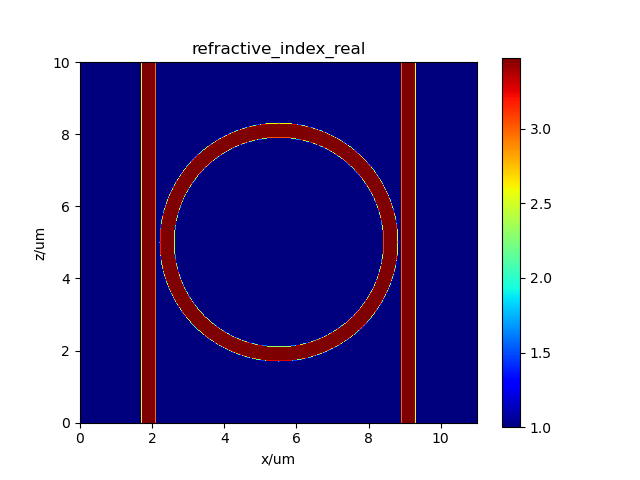
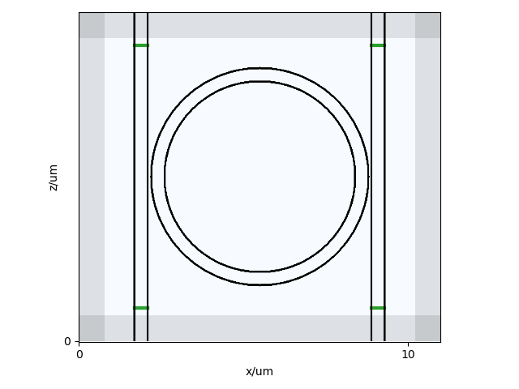
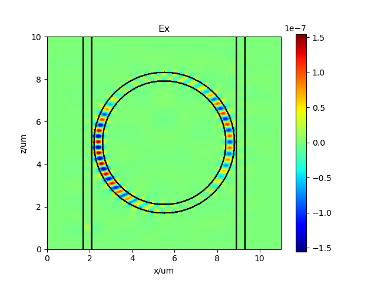
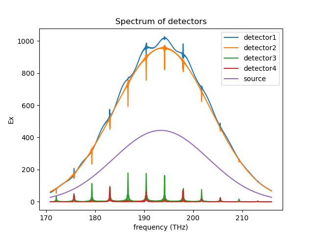
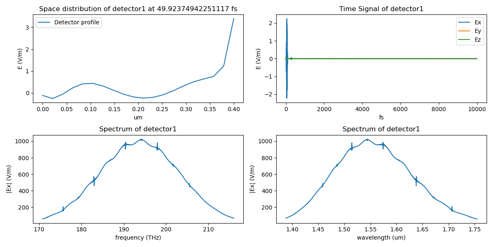
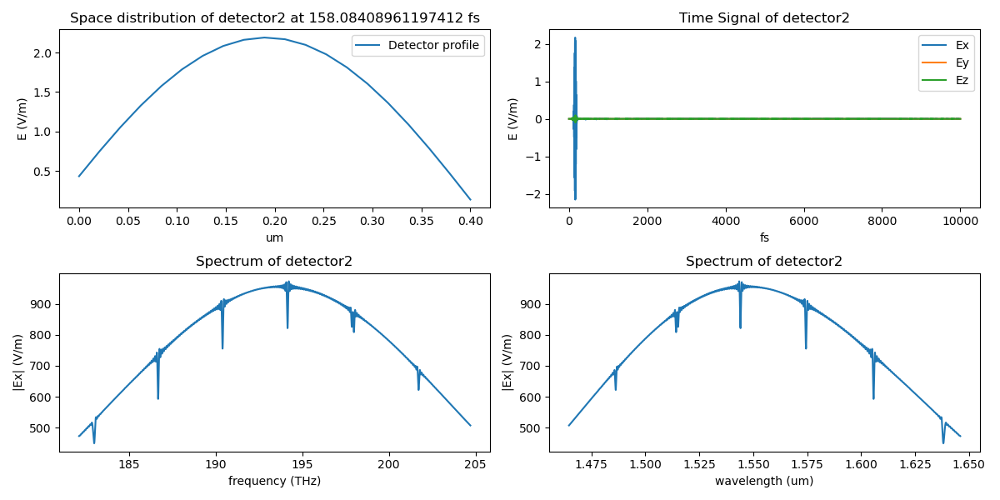
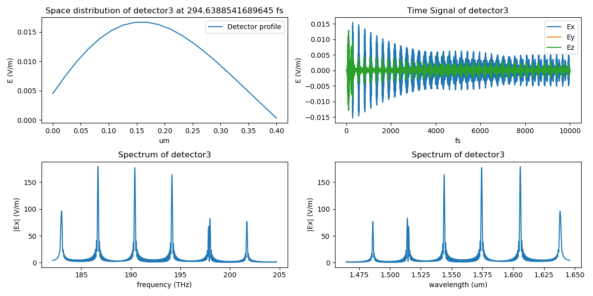
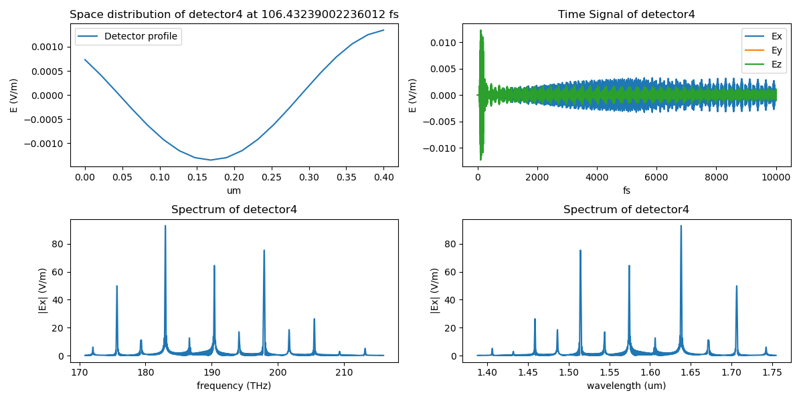
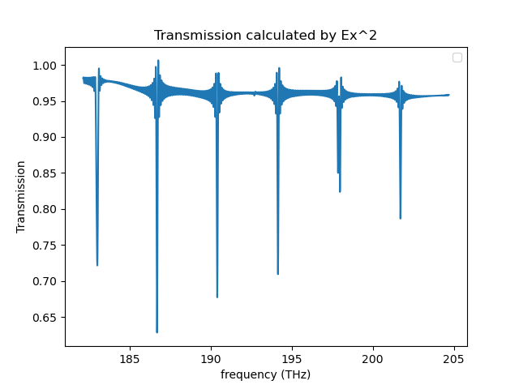
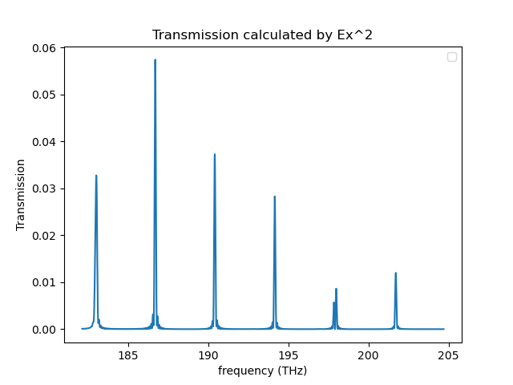

# PhotFDTD

PhotFDTD/Pyphot passive，以[fdtd](https://github.com/flaport/fdtd) 和[phisol](https://github.com/philmain28/philsol)为底层代码，实现了光传输的3D FDTD仿真和FDE模式计算，同时提供了已经封装好的数十个组件和方便使用者的示例。

PhotFDTD/Pyphotpassive, with [fdtd](https://github.com/flaport/fdtd) and [philsol](https://github.com/philmain28/philsol) as the underlying codes, realizes 3D FDTD simulation and FDE mode computation, along with dozens of packaged components and user-friendly examples.

## Components/Examples 结构/示例 

1. Waveguide - 直波导
2. Arc - 圆弧
3. Sbend - S型波导
4. Ysplitter - Y分支波导
5. Cone (fiber) - 圆锥光纤
6. Ellipsoid fiber - 椭圆形光纤
7. (Single mode) fiber - 单模光纤
8. Fan-shaped waveguide grating (fwg) - 扇形波导光栅
9. Directional coupler - 方向耦合器
10. MMI (Multimode-interferometer) - 多模耦合干涉器
11. Ring (resonator) - 环形谐振腔
12. Photonic Crystal (PC) - 光子晶体
13. Thin film filter (TFF) - 薄膜滤波器
14. Mach–Zehnder interferometer (MZI) - 马赫曾德干涉仪
15. Photonic Lanterns - 光子晶体
16. Arrayed waveguide grating (AWG) - 阵列波导光栅

## Installation 安装

The development version can be installed by cloning the repository
```
git clone http://github.com/flaport/fdtd
```

Install requirements
```
pip install -r requirements.txt
```
One can also install this repository by downloading the .zip file directly and extracting it.

## FDTD example 1: a microring resonator
Here is an example of ring_ex.py in folder "./examples" to show the workflow and usage of photfdtd. 
This example shows a 3D simulation of a a microring resonator. 
本示例展示了一个基础矩形波导的二维仿真

### Simulation set up  
Import required classes
```
import utils
from photfdtd import Ring, Grid, Index, Waveguide
```
Set material and background index 
设置材料与背景折射率
```
index_Si = Index(material="Si")
index_Re_Si, index_Im_Si = index_Si.get_refractive_index(wavelength=1.55e-6)
index_SiO2 = Index(material="SiO2")
index_Re_SiO2, index_Im_SiO2 = index_SiO2.get_refractive_index(wavelength=1.55e-6)
```
新建仿真空间
Create a 3D simulation region of 15um x 2.5um x 20um, with a grid spacing of 40nm. 
```
grid = Grid(grid_xlength=2e-6, grid_ylength=1, grid_zlength=2e-6, grid_spacing=20e-9, permittivity=1 ** 2, foldername="test_ring_0401_input")
```
设置PML边界厚度，为了减少内存占用并加快运算速度，将y方向PML厚度设置为0
Set PML, the thickness of y_PML is set to 0 to avoid RAM insufficiency.
```
grid.set_PML(pml_width_y=0e-6, pml_width_x=0.8e-6, pml_width_z=0.8e-6)
```
设置微环和基底并加入仿真空间grid
Set a ring and a subtrate and add them into simulation region (grid):
```
ring = Ring(outer_radius=3.3e-6, ylength=0.18e-6, width_s=400e-9, width_r=400e-9, length=0e-6, length_s=10e-6,
                gap=100e-9, name="ring", refractive_index=index_Re_Si, grid=grid)
substrate = Waveguide(xlength=11e-6, ylength=0.41e-6,zlength=10e-6,y=0.205e-6, refractive_index=index_Re_SiO2, grid=grid)

grid.add_object(ring)
grid.add_object(substrate)
```
Set a line source with center wavelength at 1550nm, the profile and pulse type of it are both gaussian. 
设置一个1550nm的高斯脉冲光源
The x, y, z parameters specify the center position of the source (same as waveguides and detectors). If they are not set by users, it will be automatically set to the center of the grid region. 
```
grid.set_source(source_type="linesource", wavelength=1550e-9, pulse_type="gaussian",waveform="gaussian",
                    x_start=1.7e-6,x_end=2.1e-6,
                    xlength=0.4e-6,ylength=0, zlength=0, polarization="x")
```
在每一个端口上设置一个线监视器
Set a line detector at each of the four ports

In general, the detector is necessary for calculating the S-parameters and the Fourier transform.
```
grid.set_detector(detector_type='linedetector',
                  x_start=1.7e-6, x_end=2.1e-6, z=1.0e-6,
                  ylength=1, zlength=1,
                  name='detector1')
grid.set_detector(detector_type='linedetector',
                  x_start=1.7e-6, x_end=2.1e-6, z=9e-6,
                  ylength=1, zlength=1,
                  name='detector2')
grid.set_detector(detector_type='linedetector',
                  x_start=8.9e-6, x_end=9.3e-6, z=1e-6,
                  ylength=1, zlength=1,
                  name='detector3')
grid.set_detector(detector_type='linedetector',
                  x_start=8.9e-6, x_end=9.3e-6, z=9e-6,
                  ylength=1, zlength=1,
                  name='detector4')
```
绘制结构与折射率分布
Now we can plot the geometry and the index map.
```
grid.save_fig(axis_index=31)
grid.plot_n(axis_index=31)
```


### Running and result
Run the FDTD simulation 运行仿真
```
grid.run(animate=True, time=10000e-15, save=True, interval=20)
```
保存仿真结果
Save result of simulation. The result will be saved in .h5 files. It can be read by using grid.read_simulation method, refer to [read_FDTD_simulation.py](examples/read_FDTD_simulation.py) for further details. 
```
# grid = grid.read_simulation(folder=grid.folder)
```
结果可视化
visualize the result
```
grid.visualize() 
```


可视化每一个监视器的结果
visualize result of each detector
```
freqs, spectrum1 = grid.visualize_single_detector(name_det="detector1")
freqs, spectrum2 = grid.visualize_single_detector(name_det="detector2")
freqs, spectrum3 = grid.visualize_single_detector(name_det="detector3")
freqs, spectrum4 = grid.visualize_single_detector(name_det="detector4")
```




绘制传输谱线
Draw transmission spectrum
```
import matplotlib.pyplot as plt

plt.plot(freqs, (spectrum2 / spectrum1) ** 2)
plt.ylabel("Ex")
plt.xlabel("frequency (THz)")
plt.title("Transmission calculated by Ex^2")
plt.legend()
file_name = "Transmission_detector_2"
plt.savefig(f"{grid.folder}/{file_name}.png")
plt.close()

plt.plot(freqs, (spectrum3 / spectrum1) ** 2)
plt.ylabel("Ex")
plt.xlabel("frequency (THz)")
plt.title("Transmission calculated by Ex^2")
plt.legend()
file_name = "Transmission_detector_3"
plt.savefig(f"{grid.folder}/{file_name}.png")
plt.close()

```
### Results 运行结果



## FDTD example 2: a straight waveguide
Here is an example of basic_ex.py in folder "./examples" to show the workflow and usage of photfdtd. 
This example shows a 2D simulation of a basic straight waveguide. 
本示例展示了一个基础矩形波导的二维仿真

### Simulation set up  
Import required classes
```
from photfdtd import Waveguide, Grid, Index
```
Set material and background index 
设置材料与背景折射率
```
background_index = 1.0
```
Choose Si as the material of the waveguide, index_Re_Si and index_Im_Si are the real part and imaginary part of refractive index of Si at 1550nm, respectively.
```
index_Si = Index(material="Si")
index_Re_Si, index_Im_Si = index_Si.get_refractive_index(wavelength=1.55e-6)
```
Create a 2D (y-z) simulation region of 3um x 8um, with a grid spacing of 20nm. 
新建仿真空间
```
    grid = Grid(grid_xlength=3e-6, grid_ylength=1, grid_zlength=8e-6,
                grid_spacing=20e-9,
                permittivity=background_index ** 2,
                foldername="basic_ex")
```
Set a waveguide of 200nm x 5um and add it into simulation region (grid):
```
waveguide = Waveguide(
        xlength=200e-9, ylength=1, zlength=5e-6, refractive_index=index_Re_Si, name="waveguide", grid=grid)
```
Add the waveguide to the grid, it will automatically be placed at the center of the grid. If the waveguide exceeds the grid region, an error message will be displayed.
```
grid.add_object(waveguide)
```
Set a line source with center wavelength at 1550nm, the default profile of source is CW. 
设置一个1550nm的CW线光源
The x, y, z parameters specify the center position of the source (same as waveguides and detectors). If they are not set by users, it will be automatically set to the center of the grid region. 
```
grid.set_source(source_type="linesource", wavelength=1550e-9, name="source", x=75, y=0, z=60,
                    xlength=400e-9, ylength=0, zlength=0, polarization="x")
```
Set a line detector 
设置一个线监视器
In general, the detector is necessary for calculating the S-parameters and the Fourier transform, but if simulation data in the time domain are not needed, then this step can be omitted.
```
grid.set_detector(detector_type="linedetector",
                  name="detector",
                  x=75,
                  y=0,
                  z=300,
                  xlength=400e-9,
                  ylength=0,
                  zlength=0
                  )
```
Now we can plot the geometry and the index map.
```
grid.save_fig()
```
Plot the refractive index map on z=0 
绘制z=0截面折射率分布
```
grid.plot_n()
```
### Running and result
Run the FDTD simulation 运行仿真
```
grid.run()
```
Save result of simulation. The result will be saved in a .npz file, which is a numpy file. It can be read by using grid.read_simulation method, refer to [read_FDTD_simulation.py](examples/read_FDTD_simulation.py) for further details. 
保存仿真结果
```
grid.save_simulation()
# grid = grid.read_simulation(folder=grid.folder)
```
The field distribution at the end of the simulation. 
绘制仿真结束时刻空间场分布
```
Grid.plot_field(grid=grid, field="E", field_axis="x", axis="y", axis_index=0, vmin=-1, vmax=1)
```
If a detector has been added, the change curve of time domain at a certain point can be plotted, here choose index=30, that is, the center of the detector. 
如果添加了监视器，还可以绘制某一点时域场变化曲线，这里选择index=10. 即监视器中心
```
Grid.plot_fieldtime(folder=grid.folder, grid=grid, field_axis="z", index=10, name_det="detector")
```
With a detector, we can also draw a frequency spectrum.
```
Grid.compute_frequency_domain(grid=grid, wl_start=1000e-9, wl_end=2000e-9, name_det="detector",
                                  index=10, field_axis="x", field="E", folder=None)
```
### Results 运行结果


### Other examples 各种光器件使用示例
In the [examples](examples) directory, you can see examples of various optical devices, e.g. [waveguide_ex.py](examples/waveguide_ex.py) represents an example of a straight waveguide.

## Mode solver example
Here is an example of solving modes of a single mode fiber from "[fiber_ex.py](examples/mode_solver/fiber_ex.py)" to analyze a single mode fiber using photfdtd. This example demonstrates the setup and usage of photfdtd mode solver.
Parameters of the single mode fiber are as follows:
```
# Single mode fiber 单模光纤模式分析
# clad refractive index：1.4437 包层折射率
# core refractive index：1.4504 纤芯折射率
# core radius：4um
# Pml thickness：3um
# wavelength：1.55um 
```
Import required classes:
```
from photfdtd import Fiber, Grid, Solve
```
Set background index:
```
background_index = 1.4437
```
Create simulation region (grid) 
新建一个 grid 对象
```
grid = Grid(grid_xlength=200 * 200e-9, grid_ylength=200 * 200e-9, grid_zlength=1, grid_spacing=200e-9,
            foldername="test_fiber", permittivity=background_index ** 2)
```
Set fiber parameters and add it to grid
```
fiber = Fiber(length=1 * 200e-9, radius=[20 * 200e-9, 40 * 200e-9], refractive_index=[1.4504, 1.4555], name='fiber', axis='z', grid=grid)
grid.add_object(fiber)
```
Create a Solve variant, which is essential for solving mode 
创建solve类变量
```
solve = Solve(grid=grid,
              axis="z",
              filepath=grid.folder,
              index=0
              )
```
Refractive index plot and geometry plot 
绘制折射率分布
```
solve.plot()
# We can plot the geometry now
绘制x=0截面结构图
grid.save_fig(axis="z", axis_number=0)
```

Caculate 2 modes around 1.4504 at 1.55um, the boundaries are PML
计算这个截面处，波长1.55um，折射率1.4504附近的2个模式，边界条件选择在四个方向上都是pml
```
data = solve.calculate_mode(lam=1550e-9, neff=1.4504, neigs=20,
                            x_boundary_low="pml", y_boundary_low="pml",
                            x_boundary_high="pml",
                            y_boundary_high="pml",
                            background_index=background_index)
```
Save results
```
Solve.save_mode(solve.filepath, data)
```
Draw results
```
Solve.draw_mode(filepath=solve.filepath, data=data, content="amplitude")
# Solve.draw_mode(filepath=solve.filepath, data=data, content="real_part")
# Solve.draw_mode(filepath=solve.filepath, data=data, content="imaginary_part")
# Solve.draw_mode(filepath=solve.filepath, data=data, content="phase")
```
## Developer documents 开发者文档

[开发者文档](docs/developer-guide.md) 提供了对于开发者的指导。
