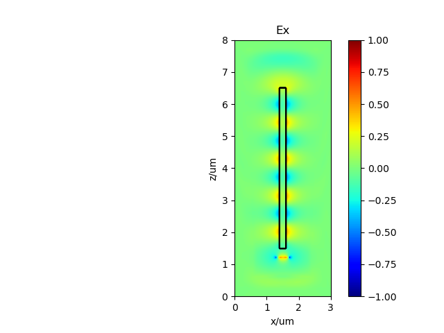
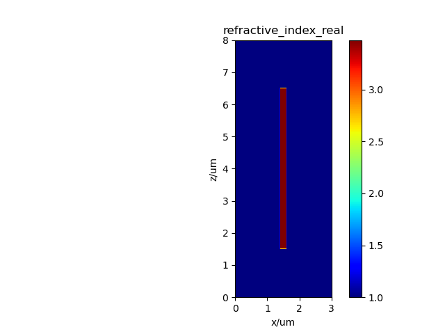
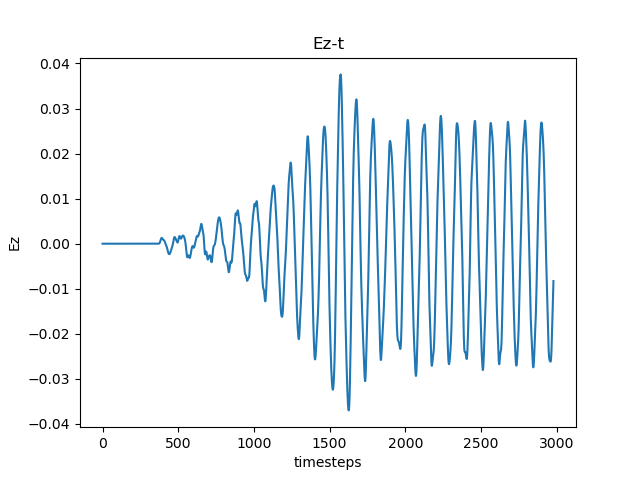
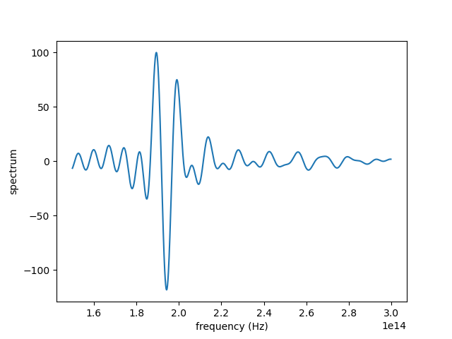

# PhotPassive说明

[TOC]

## 1 模块简介

该软件是一款功能强大且灵活的光器件仿真工具，能够支持包括光波导在内的多种无源光器件的仿真运算。其模块化设计使用户可以通过 PhotPassive 模块中的各种类和方法灵活地组合和配置仿真任务。用户可以设置背景介质的折射率，创建高分辨率的仿真网格，详细定义光器件的几何尺寸和光学特性，灵活配置光源参数，并添加监视器以检测电磁场变化。此外，该软件还提供了强大的结果处理和可视化功能，使用户能够方便地保存、读取和绘制仿真结果。

## 2 功能说明

Pyphot passive，以[fdtd](https://github.com/flaport/fdtd) 和[phisol](https://github.com/philmain28/philsol)为底层代码，实现了光传输的三维时域仿真和二维模式计算，同时提供了已经封装好的波导和数十个方便使用者的示例。

* Waveguide - 直波导
* Arc - 圆弧
* Sbend - S型波导
* Ysplitter - Y分支波导
* Cone (fiber) - 圆锥光纤
* Ellipsoid fiber - 椭圆形光纤
* (Single mode) fiber - 单模光纤
* Fan-shaped waveguide grating (fwg) - 扇形波导光栅
* Directional coupler - 方向耦合器
* Mmi (Multimode-interferometer) - 多模耦合干涉器
* Ring (resonator) - 环形谐振腔
* Photonic Crystal (PC) - 光子晶体
* Thin film filter (TFF) - 薄膜滤波器
* Mach–Zehnder interferometer (MZI) (in progress) - 马赫曾德干涉仪（未完成）

## 3 依赖环境

开发版本可以通过克隆代码库来安装：

```
git clone http://github.com/flaport/fdtd
```

安装依赖项：

```
pip install -r requirements.txt
```

你也可以通过直接下载并解压.zip文件来安装它。


## 4 开发指南

以下是使用 photfdtd 进行基本直波导 2D 仿真的工作流程和用法示例。

本示例展示了一个基础矩形波导的二维仿真。

### 4.1 仿真设置

导入所需的类：

```python
from photfdtd import Waveguide, Grid, Index
```

设置材料和背景折射率：

```python
background_index = 1.0
```

选择硅（Si）作为波导材料，`index_Re_Si` 和 `index_Im_Si` 分别是 1550nm 波长下硅的折射率的实部和虚部：

```python
index_Si = Index(material="Si")
index_Re_Si, index_Im_Si = index_Si.get_refractive_index(wavelength=1.55e-6)
```

创建一个 3μm x 8μm 的二维（y-z）仿真区域，网格间距为 20nm：

```python
grid = Grid(grid_xlength=3e-6, grid_ylength=1, grid_zlength=8e-6,
            grid_spacing=20e-9,
            permittivity=background_index ** 2,
            foldername="basic_ex")
```

设置一个 200nm x 5μm 的波导并将其添加到仿真区域（网格）中：

```python
waveguide = Waveguide(
        xlength=200e-9, ylength=1, zlength=5e-6, refractive_index=index_Re_Si, name="waveguide", grid=grid)
```

将波导添加到网格中，波导会自动放置在网格的中心。如果波导超出网格区域，将显示错误信息：

```python
grid.add_object(waveguide)
```

设置中心波长为 1550nm 的线光源，光源的默认模式是连续波（CW）：

```python
grid.set_source(source_type="linesource", wavelength=1550e-9, name="source", x=75, y=0, z=60,
                xlength=400e-9, ylength=0, zlength=0, polarization="x")
```

设置一个线监视器（探测器）：

```python
grid.set_detector(detector_type="linedetector",
                  name="detector",
                  x=75,
                  y=0,
                  z=300,
                  xlength=400e-9,
                  ylength=0,
                  zlength=0
                  )
```

现在可以绘制几何结构和折射率分布图：

```python
grid.save_fig()
```

绘制 z=0 截面的折射率分布：

```python
grid.plot_n()
```

### 4.2 运行和结果

运行 FDTD 仿真：

```python
grid.run()
```

保存仿真结果，结果将保存为 .npz 文件，可以使用 `grid.read_simulation` 方法读取，详细信息请参考 [read_FDTD_simulation.py](examples/read_FDTD_simulation.py)：

```python
grid.save_simulation()
# grid = grid.read_simulation(folder=grid.folder)
```

绘制仿真结束时的场分布：

```python
Grid.plot_field(grid=grid, field="E", field_axis="x", axis="y", axis_index=0, vmin=-1, vmax=1)
```

如果添加了监视器，还可以绘制某一点时域场变化曲线，这里选择 index=10，即监视器的中心：

```python
Grid.plot_fieldtime(folder=grid.folder, grid=grid, field_axis="z", index=10, name_det="detector")
```

使用监视器，我们还可以绘制频谱图：

```python
Grid.compute_frequency_domain(grid=grid, wl_start=1000e-9, wl_end=2000e-9, name_det="detector",
                              index=10, field_axis="x", field="E", folder=None)
```

### 4.3 运行结果






### 4.4 其他示例

在 [examples](examples) 目录中，你可以看到各种光学器件的示例，例如 [waveguide_ex.py](examples/waveguide_ex.py) 代表了一个直波导的示例。

#### 模式求解器示例

以下是解决单模光纤模式的示例 "[fiber_ex.py](examples/mode_solver/fiber_ex.py)"，用于分析使用 photfdtd 的单模光纤。此示例展示了 photfdtd 模式求解器的设置和使用。

单模光纤的参数如下：

```
# 单模光纤模式分析
# 包层折射率：1.4437
# 纤芯折射率：1.4504
# 纤芯半径：4um
# PML 厚度：3um
# 波长：1.55um 
```

导入所需的类：

```python
from photfdtd import Fiber, Grid, Solve
```

设置背景折射率：

```python
background_index = 1.4437
```

创建仿真区域（网格）：

```python
grid = Grid(grid_xlength=200 * 200e-9, grid_ylength=200 * 200e-9, grid_zlength=1, grid_spacing=200e-9,
            foldername="test_fiber", permittivity=background_index ** 2)
```

设置光纤参数并将其添加到网格中：

```python
fiber = Fiber(length=1 * 200e-9, radius=[20 * 200e-9, 40 * 200e-9], refractive_index=[1.4504, 1.4555], name='fiber', axis='z', grid=grid)
grid.add_object(fiber)
```

创建 Solve 变量，这对于求解模式是必要的：

```python
solve = Solve(grid=grid,
              axis="z",
              filepath=grid.folder,
              index=0
              )
```

绘制折射率分布和几何结构图：

```python
solve.plot()
# 绘制x=0截面结构图
grid.save_fig(axis="z", axis_number=0)
```

计算波长 1.55um、折射率 1.4504 附近的 2 个模式，边界使用 PML：

```python
data = solve.calculate_mode(lam=1550e-9, neff=1.4504, neigs=20,
                            x_boundary_low="pml", y_boundary_low="pml",
                            x_boundary_high="pml",
                            y_boundary_high="pml",
                            background_index=background_index)
```

保存结果：

```python
Solve.save_mode(solve.filepath, data)
```

绘制结果：

```python
Solve.draw_mode(filepath=solve.filepath, data=data, content="amplitude")
```

## 5 调试方法

1. 使用print语句：
   - 在代码中插入`print()`语句来输出变量的值或程序的执行状态。这是最简单的方法，适合快速了解程序的运行情况。
2. 使用断点和调试器：
   - 大多数IDE（如PyCharm、VSCode）都有内置的调试器。你可以在代码中设置断点，然后逐步执行代码，检查每一步的状态。
   - 例如，在VSCode中，你可以设置一个断点，然后按F5启动调试模式。
3. 使用pdb模块：
   - Python自带一个调试模块`pdb`。你可以在代码中插入`import pdb; pdb.set_trace()`来启动交互式调试会话。
   - 在这个会话中，你可以执行命令如`n`（下一步）、`c`（继续运行）、`q`（退出）等。

## 6 打包方式

打包项目可以使用`setuptools`或`wheel`。首先，确保您已经安装了这些工具：

```
pip install setuptools wheel
```

然后，在项目根目录中运行：

```
python setup.py sdist bdist_wheel
```

这会在`dist/`目录中创建`.tar.gz`和`.whl`文件。

## 7 部署步骤

本软件无需部署。

## 8 版权声明

